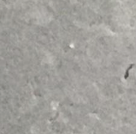
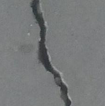
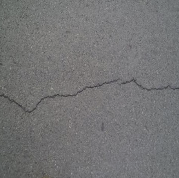
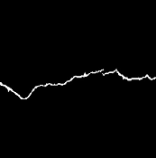
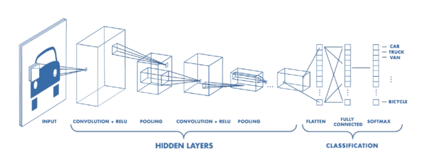
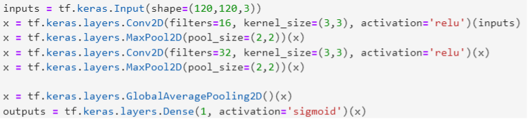
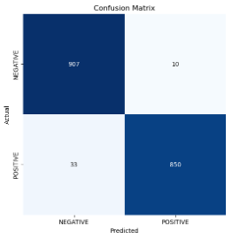
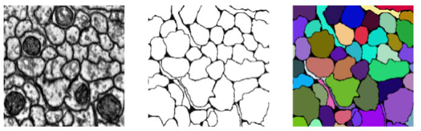
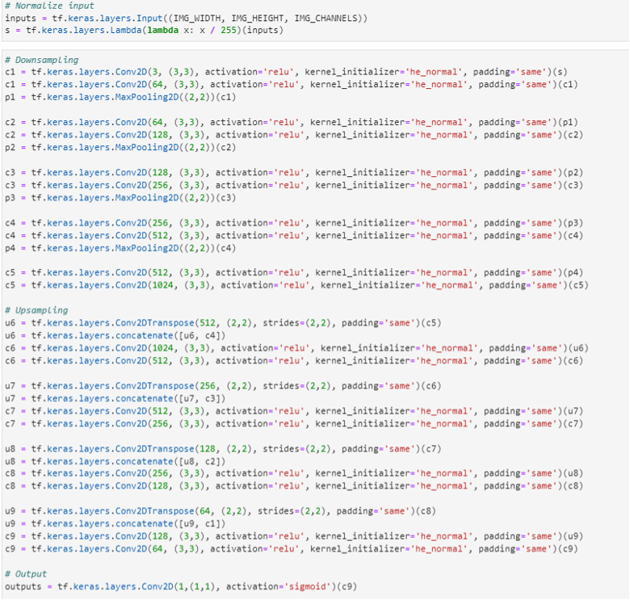

## Description

In this project, we plan to use two main datasets to detect concrete crack. First, we use a dataset from Kaggle, titled “Surface Crack Detection” to make the classification of the concrete crack. Second, we use a dataset from Virginia Tech, titled “Concrete Crack Conglomerate Dataset” to make the segmentation of the concrete crack.

[Classification]

Source: Kaggle/ Surface Crack Detection.

Data Format: Images with 227*227 pixels with RGB channels.

Content: The dataset contains images of various concrete surfaces with and without crack. The image data are divided into two as negative (without crack) and positive (with crack) for image classification. Each class has 20000 images with a total of 40000 images.

Figure 1. Example of Images with and without Cracks

[Segmentation]

Source: Virginia Tech/ Concrete Crack Conglomerate Dataset

Data Format: Images with 448*448 pixels with RGB channels

Content: The dataset contains over 10,995 crack images. Each image data has its origin image and mask image for image segmentation.

Figure 2. Example of an Original Image and an Mask Image

## Proposal:

In our project, we plan to train two models to detect concrete crack. First, by using the classification dataset, we plan to detect concrete crack based on convolutional neural network (CNN) to find out whether the concrete is defective. Second, by using the segmentation dataset, we plan to conduct concrete crack segmentation based on U Net to illustrate the position of the crack on concrete crack images.

## Exploratory Data Analysis

In classification, the dataset consists of 20,000 images with cracks and 20,000 images without cracks. We are planning to use convolutional neural network to train a classification model.

Figure 3. Number of Images with and without Cracks

In segmentation, we use the dataset consists of 21,996 images, splitting it into train data with 19,801 images and train data with 2,195 images. Here, we’ll be applying U Net to train a model that is capable of pointing out the cracks in a concrete image.

Figure 4. Number of Train Images and Test Images

## Preliminary Predictive Modeling

Dataset: 
- Concrete images with attached label 'Positive' or 'Negative'
- Concrete images and their masks

Goal:
- Concrete crack detection
- Concrete crack segmentation

Architecture:
- Concrete crack detection based on convolutional neural network (CNN)
- Concrete crack segmentation based on U-Net and improved U-Net using Inception as backbone

## Concrete crack detection 

{#fig:Basic_Convolutional_Neural_Network_for_Classification}

## Model and training 
Here we need to specify the hyperparameters of our layers:
  1. Convolutional layer. Convolution is an operation that use filter to extract information that we want to detect. 
      a. Filter size determines how many filters that would apply on the input tensor to produce the same number of channels, each filter could detect their specified geometries with colors in the given kernel size. 
      b. Kernel size determines the size of the area the filters would apply. 
      c. Activation function is added to achieve nonlinearity of the model, as the operation of filter is linear.
  3. MaxPooling layer. MaxPooling is a down-sampling operation that allows our network to capture deeper information from original dimensions. 
      a. Pool size and strides determine the dimensions of down-sample procedure. 
     
In the first convolutional block, we would specify 16 filters (consider 8 straight lines and 8 curves) with 3 by 3 kernel (consider the size of crack is relatively small) and ReLu as activation function in the Conv2D layer and go deeper with pool size of 2 by 2 in the MaxPool2D layer.

And in the second convolutional block, we double the channels number to 32 with Conv2D, apply the same MaxPool2D.

Finally, we process our data input an GlobalAveragePooling2D layer (because we are focusing on the whole image, not a part of it in segmentation) and dense the tensor to 1 with Sigmoid function (As we only have 1 class of result, for multiclass classification, use SoftMax).

The result of our network would be a number in (0,1), we could treat this as a probability of crack in the image.

{#fig:Model_for_Concrete_Crack_Classification_using_Keras}

Notice that the original images have size of (227,227,3), we would resize it into (120,120,3) in preprocess procedure.

{#fig:Model_Summary_and_Hyperparameters}

| training   | 3360 |
|:-----------|:-----|
| validation | 840  |
| testing    | 1800 |
| Optimizer | Adam |
| Loss Function | Binary Crossentropy |
| Metrics | Accuracy |
| Epochs | 100 | 

Table: Hyperparameters.
{#tbl:CNNHyperparameters}

[Crack detection]
Dataset: Surface Crack Detection | Kaggle Positive: 20000 Negative: 20000
Training, validating, testing: 3360, 840, 1800
Network: CNN

Figure 5. Schematic of CNN

Figure 6. Code of CNN

Input: images with 120x120x3 [height, width, channel (RGB)] (resized from 227x227)

Output: some kind of probability (was proceed by sigmoid)

Solver: Adam

Loss: Binary Cross Entropy

Testing result: True Positive, False Positive, True Negative, False Negative.

Positive or negative was predicted by the network, and true or false is the result of prediction (right or wrong)

Figure 7. Confusion Matrix of the Test Result

[Crack Segmentation]
Dataset: Concrete Crack Conglomerate Dataset (vt.edu)

Would only use a part of it (107 for training and validating, 11 for testing) as U-Net is an effective architecture.

Network: U-Net [1505.04597v1] U-Net: Convolutional Networks for Biomedical Image Segmentation (arxiv.org)

Figure 8. Schematic of a U Net

Here we would have input with 3 channel, and would become 16 channel after the first convolution.

 

Figure 9. Example of U Net Applied in Biomedical Image

U net applied in crack detection Computer vision-based concrete crack detection using U-net fully convolutional networks - ScienceDirect (It has almost the same structure with original U-net, but we would use a different channel number, we would also use a different architecture with pretrained convolutional neural network as backbone (VGG, ResNet, Inception))

Figure 10. Code of U Net

Input: images with 120x120x3 [height, width, channel (RGB)] (resized from 227x227)

Output: some kind of probability (was proceed by sigmoid)

Solver: Adam

Loss: Binary Cross Entropy
