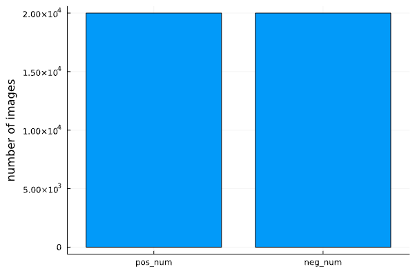
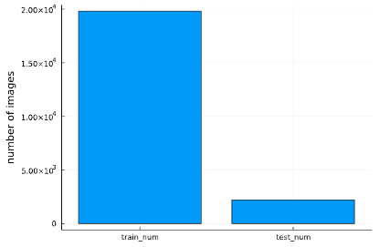

## Description
Examples are shown in Figure @fig:Negative_and_Positive. 

{#fig:Negative_and_Positive}

We then train a CNN-based network call U-Net [@doi:10.1007/978-3-319-24574-4_28] with the Concrete Crack Conglomerate Dataset [@doi:10.7294/16625056.v1] to segment the concrete from its cracks. The dataset contains over 10,995 crack images (each has 448*448 pixels and RGB channels). Each image data has an origin image and a mask image. Examples are shown in Figure @fig:Origin_and_Mask. 

{#fig:Origin_and_Mask}

## Proposal:

In our project, we plan to train two models to detect concrete crack. First, by using the classification dataset, we plan to detect concrete crack based on convolutional neural network (CNN) to find out whether the concrete is defective. Second, by using the segmentation dataset, we plan to conduct concrete crack segmentation based on U Net to illustrate the position of the crack on concrete crack images.

## Exploratory Data Analysis

In classification, the dataset consists of 20,000 images with cracks and 20,000 images without cracks. We are planning to use convolutional neural network to train a classification model.

Figure 3. Number of Images with and without Cracks

In segmentation, we use the dataset consists of 21,996 images, splitting it into train data with 19,801 images and train data with 2,195 images. Here, we’ll be applying U Net to train a model that is capable of pointing out the cracks in a concrete image.

Figure 4. Number of Train Images and Test Images

## Preliminary Predictive Modeling

Dataset: 

- Concrete images with attached label 'Positive' or 'Negative'
- Concrete images and their masks

Goal:

- Concrete crack detection
- Concrete crack segmentation

Architecture:

- Concrete crack detection based on convolutional neural network (CNN)
- Concrete crack segmentation based on U-Net and improved U-Net using Inception as backbone

## Concrete Crack Detection 

{#fig:Basic_Convolutional_Neural_Network_for_Classification}

### Modeling and training 
Here we need to specify the hyperparameters of our layers:

1. Convolutional layer. Convolution is an operation that use filter to extract information that we want to detect. 
    a. Filter size determines how many filters that would apply on the input tensor to produce the same number of channels, each filter could detect their specified geometries with colors in the given kernel size. 
    b. Kernel size determines the size of the area the filters would apply. 
    c. Activation function is added to achieve nonlinearity of the model, as the operation of filter is linear.
2. MaxPooling layer. MaxPooling is a down-sampling operation that allows our network to capture deeper information from original dimensions. 
    a. Pool size and strides determine the dimensions of down-sample procedure. 
     
In the first convolutional block, we would specify 16 filters (consider 8 straight lines and 8 curves) with 3 by 3 kernel (consider the size of crack is relatively small) and ReLu as activation function in the Conv2D layer and go deeper with pool size of 2 by 2 in the MaxPool2D layer.

And in the second convolutional block, we double the channels number to 32 with Conv2D, apply the same MaxPool2D.

Finally, we process our data input an GlobalAveragePooling2D layer (because we are focusing on the whole image, not a part of it in segmentation) and dense the tensor to 1 with Sigmoid function (As we only have 1 class of result, for multiclass classification, use SoftMax).

The result of our network would be a number in (0,1), we could treat this as a probability of crack in the image.

{#fig:Model_for_Concrete_Crack_Classification_using_Keras}

Notice that the original images have size of (227,227,3), we would resize it into (120,120,3) in preprocess procedure.

{#fig:Model_Summary_and_Hyperparameters height=3in}

| training   | validation | testing    | Optimizer | Loss Function | Metrics | Epochs |
|:-----------|:------|:------|:------|:------|:------|:------|
| 3360 | 840  | 1800 | Adam | Binary Crossentropy | Accuracy | 100 | 

Table: Hyperparameters.
{#tbl:CNNHyperparameters}

### Prediction and Analysis 

We can check our trained model by inputting the testing data, below is the confusion matrix our model generated:

{#fig:Confusion_Matrix height=3in}

{#fig:Loss_Evolution height=2in}

We can see that this trained model has good performance on the testing data, it only takes 25 epochs because of our early stop condition.
We can further calculate the following parameters:

$$
\mathrm{Precision}=\frac{TP}{TP+FP}
\\
\mathrm{Recall}=\frac{TP}{TP+FN}
\\
\mathrm{Score}=2\times \frac{\mathrm{Precision}\times \mathrm{Recall}}{\mathrm{Precision}+\mathrm{Recall}}
\\
\mathrm{Macro} \mathrm{Avg}=\frac{1}{n}\sum_{i=1}^n{\mathrm{Score}_i}
\\
\mathrm{Weighted} \mathrm{Avg}=\frac{1}{n}\sum_{i=1}^n{\mathrm{Support}_i\times \mathrm{Score}_i}
$${#eq:regular-equation}

| | Precision | Recall | Score | Support |
|:-----------|:------|:------|:------|:------|
| Negative	| 0.96|	0.99 | 0.98 | 917 | 
| Positive | 0.99 | 0.96 | 0.97 | 883 |	
| Macro Avg | 0.98 | 0.97 | 0.97 | 1800 |	
| Weighted Avg | 0.97 | 0.97 | 0.97 | 1000 |	

Table: Result Analysis
{#tbl:Result_Analysis}

It has overall good performance.

## Concrete Segmentation 

The original U-Net architecture is shown below:

{#fig:U-net_Architecture}

### Modeling and Training 

For achieving segmentation, we have built and trained two models, one based on our own architecture, and the other based on the paper. 
We perform a normalization before plug in the U-Net architecture based on the range of RGB number:

{#fig:Input_Normalization}

In the previous classification model, we have shown that the first convolutional block would only need 16 filters to perform well. We also add the random dropout in each convolution blocks to prevent the overfitting problem. Based on this experiment, we modified U-Net architecture as figure shown below. 

{#fig:Modified_U-Net_Architecture}

Notice that the original images have size of (448,448,3), we would keep this size for this network, but there is still a resize procedure that allow this network to predict images with different size.

{#fig:Model_Summary}

U-Net could learn from very few numbers of dataset, so we only need to have a small dataset.

{#fig:U-Net_Loss}

| training   | validation | testing    | Optimizer | Loss Function | Metrics | Epochs |
|:-----------|:------|:------|:------|:------|:------|:------|
| 105 | 2 | 17 | Adam | Binary Crossentropy | Accuracy | 50 |

Table: U-Net Hyperparameters.
{#tbl:U-NetHyperparameters}

We can see that this trained model has good performance on the testing data, it only takes 30 epochs because of our early stop condition.

## Prediction and Analysis 

{#fig:Prediction_Result}

Here are the prediction results of our testing images, it performs extremely well.

We could also notice that in the testing image 7, the network predict zone with dark color as crack. It is because the filter would not only capture geometries of the image in the kernel, but also the color of it (recall we have RGB channels as the input).

We are still working on the next U-Net model with Conv2D=>BatchNormalization=>ReLU  as conv_block!
We also trained a U-Net model with pretrained Inception as backbone, but we haven’t upload it yet!

Computer vision-based concrete crack detection using U-net fully convolutional networks
[@doi:10.1016/j.autcon.2019.04.005]

U-Net: Convolutional Networks for Biomedical Image Segmentation
[@doi:10.1007/978-3-319-24574-4_28]

Surface Crack Detection | Kaggle
[@{https://www.kaggle.com/datasets/arunrk7/surface-crack-detection}].

Concrete Crack Conglomerate Dataset | Virginia Tech
[@doi:10.7294/16625056.v1]

Performance Evaluation of Deep CNN-Based Crack Detection and Localization Techniques for Concrete Structures
[@doi:10.3390/s21051688]
