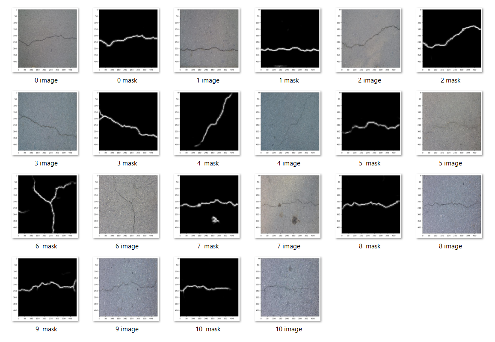

## Introduction

The existence of cracks in concrete materials is of vital importance in Civil Engineering. An accurate and fast method to detect the existence of cracks in concrete images is always sought by engineers. Nowadays, even though a Convolutional neural network (CNN) based model can easily tell the existence of concrete cracks, the information on the exact locations of cracks is smeared in the network. We aim first to build a CNN-based model for crack detection and then apply another model called U-Net to locate and show the exact positions of cracks. 

We first train a CNN with the Surface Crack Detection dataset [@{https://www.kaggle.com/datasets/arunrk7/surface-crack-detection}] to judge if any concrete crack exists. The dataset contains images (each has $227 \times 227$ pixels and RGB channels) of concrete surfaces with or without cracks. Each class contains $20000$ images. Examples are shown in Figure @fig:Negative_and_Positive:

{#fig:Negative_and_Positive height=2in}

The dataset is split into a training set with 4200 images and a testing set with 1800 images randomly selected from the dataset.

We then train an FCN-based network called U-Net [@doi:10.1007/978-3-319-24574-4_28] with the Concrete Crack Conglomerate Dataset [@doi:10.7294/16625056.v1] to segment the concrete from its cracks. 

The dataset contains over $20000$ crack images which include subsets named CFD, CRACK500, CRACKTREE etc. (each has $448 \times 448$ pixels and RGB channels). Each image data has an original image and a mask image. Examples are shown in Figure @fig:Origin_and_Mask:

{#fig:Origin_and_Mask height=2in}

U-Net is an elegant architecture that can work with very few training images and yield precise segmentations. [@doi:10.1007/978-3-319-24574-4_28] Different from the large number of images used in classification, we only chose the CFD sets with 107 images for training and 11 for testing.

## Crack Detection by CNN

### A Brief Introduction to CNN 

{#fig:Basic_Convolutional_Neural_Network_for_Classification}

CNN network is briefly introduced in this section. As shown in Figure @fig:Basic_Convolutional_Neural_Network_for_Classification, a typical CNN network involves several convolutional and pooling layers and several fully connected layers. Convolution is an operation that uses filters to extract information that we want to detect. The filter size determines how many filters will be applied to the input data. The kernel size determines the size of the area to which the filters would apply. Activation functions are added to import nonlinearity into the model, considering the linear filter operation. MaxPooling is a down-sampling operation that allows our network to capture deeper information from its original dimensions. The pool size and strides determine the dimensions of the down-sample procedure. Notice that the sigmoid function (rather than the softmax function shown in Figure @fig:Basic_Convolutional_Neural_Network_for_Classification) will be applied in our model, as we only have two classes of results (True or False). 

### Network Design
In the first convolutional block, we would specify 16 filters (consider 8 straight lines and 8 curves) with 3 by 3 kernels (considering the size of the crack is relatively small), assign ReLu as the activation function in the Conv2D layer, and go deeper with a pool size of 2 by 2 in the MaxPool2D layer. In the second convolutional block, we double the channel number to 32 with Conv2D and apply the same MaxPool2D. Finally, we apply a GlobalAveragePooling2D layer, focusing on the whole image rather than a part of it in segmentation. The coding form of this model is shown in Figure @fig:Model_for_Concrete_Crack_Classification_using_Keras:

{#fig:Model_for_Concrete_Crack_Classification_using_Keras}

The result of our network would be a number in (0,1). We may treat it as the probability of the existence of cracks in the image. Noticing that the original images have the size (227,227,3), we would resize it into (120,120,3) in the preprocessing procedure. The detailed properties of the network are listed in Figure @fig:Model_Summary_and_Hyperparameters and Table @tbl:CNNHyperparameters:

{#fig:Model_Summary_and_Hyperparameters height=4in}

| Training   | Validation | Testing    | Optimizer | Loss Function | Metrics | Max Epochs |
|:-----------|:------|:------|:------|:------|:------|:------|
| 4200 | 20% | 1800 | Adam | Binary Crossentropy | Accuracy | 100 | 

Table: **Hyperparameters**
{#tbl:CNNHyperparameters}

### Results and Analysis 

Below is the confusion matrix our model generated:

{#fig:Confusion_Matrix height=3in}

and the loss during the training process: 

{#fig:Loss_Evolution height=3in}

We can see that this trained model performs well on the testing data. The training process only lasts for 25 epochs because of the early-stop procedure. We can further calculate the following parameters:

$$
\mathrm{Precision}=\frac{TP}{TP+FP}
\\
\mathrm{Recall}=\frac{TP}{TP+FN}
\\
\mathrm{Score}=2\times \frac{\mathrm{Precision}\times \mathrm{Recall}}{\mathrm{Precision}+\mathrm{Recall}}
\\
\mathrm{Macro} \mathrm{Avg}=\frac{1}{n}\sum_{i=1}^n{\mathrm{Score}_i}
\\
\mathrm{Weighted} \mathrm{Avg}=\frac{1}{n}\sum_{i=1}^n{\mathrm{Support}_i\times \mathrm{Score}_i}
$${#eq:regular-equation}

Their specific values are shown in Table @tbl:Result_Analysis:

| | Precision | Recall | Score | Support |
|:-----------|:------|:------|:------|:------|
| Negative	| 0.96|	0.99 | 0.98 | 917 | 
| Positive | 0.99 | 0.96 | 0.97 | 883 |	
| Macro Avg | 0.98 | 0.97 | 0.97 | 1800 |	
| Weighted Avg | 0.97 | 0.97 | 0.97 | 1000 |	

Table: **Result Analysis**
{#tbl:Result_Analysis}

In short, the network has overall good performance.

## Crack Segmentation by U-Net

### A Brief Introduction to U-Net 

U-Net is built upon the so-called "Fully Convolutional Network", it was first introduced in 2015 and won the ISBI challenge for segmentation of neuronal structures in electron microscopic stacks. The original U-Net architecture is shown below:

{#fig:U-net_Architecture}

Different from FCN, it supplements a usual contracting network with successive layers, where pooling operators are replaced by upsampling operators. It would keep the output from each convolutional layer by either concatenating it with the unsampled results or simply adding them together. This modification can take advantage of these procedures to overcome the trade-off between localization accuracy and the use of context (FCN requires more max-pooling layers which reduce the localization accuracy, while small patches allow the network to see only little context).

### Modeling and Training 

To achieve segmentation, we have built and trained two models, one based on our architecture and the other based on the paper. 
We perform a normalization before plugging in the U-Net architecture based on the range of RGB numbers, as shown in @fig:Input_Normalization:

{#fig:Input_Normalization}

In the previous classification model, we have shown that the first convolutional block only needs 16 filters to perform well. We also add a random dropout in each convolution block to prevent the overfitting problem. Based on this experiment, we modified U-Net architecture as shown in Figure @fig:Modified_U-Net_Architecture: 

{#fig:Modified_U-Net_Architecture}

The original images have the size (448,448,3). We would keep this size for this network, but there is still a resizing procedure that allows this network to predict images with different sizes. The detailed architecture of this model is summarized in Figure @fig:Model_Summary:

{#fig:Model_Summary}

Other properties of this network are listed in Table @tbl:U-NetHyperparameters:

| Training   | Validation | Testing    | Optimizer | Loss Function | Metrics | Epochs |
|:-----------|:------|:------|:------|:------|:------|:------|
| 107 | 10% | 17 | Adam | Binary Crossentropy | IoUScore | 50 |

Table: **U-Net Hyperparameters**
{#tbl:U-NetHyperparameters}

The training and testing losses are plotted in Figure @fig:U-Net_Loss:

{#fig:U-Net_Loss height=3inch}

We can see that this trained model performs well on the testing data. It only takes 30 epochs because of the early-stop procedure.

### Results and Analysis 

{#fig:Prediction_Result}

The prediction results of our testing images are shown in Figure @fig:Prediction_Result. It performs well. However, we can also notice that in testing image 7, the network recognizes the dark-colored zone with noise concentration (several disconnected noise regions close to each other) as a crack. The reason is that the network identifies cracks by detecting the edge of the color channels, which can be illustrated by predicting the crack from the RGB color wheel as shown in Figure @fig:RGB_wheel_Result:

{#fig:RGB_wheel_Result}

Several actions can be taken to avoid this noise concentration:

1. **Replace MaxPooling2D layers by AveragePooling2D.** AveragePooling2D could perform a flatten operation on its input. Rather than highlight the maximum point with MaxPooling2D, the network would generally benefit from this process.
2. **Build Up Preprocessor**
    a. *Normalize by Gray Scale.* There is a trade-off in the grayscale process: we will lose information during this procedure, but we can also take advantage as all the data is in the same stage with only one channel.
    b. *Multi-Kernel filters.* This process was inspired by the Inception network (the winner of the ImageNet Large Scale Visual Recognition Competition in 2014). The basic idea is to use multiple convolutional and pooling layers to extract more information from the input data. 

The non-trainable Pooling layer is necessary to ensure the preprocessor works on our purpose.

We would not provide the detailed model in this case because we focus on one question: will our model (trained on the CFD dataset) work well with other datasets? We will answer this question in the next section.

## Crack Segmentation on Rough Surfaces by Interception U-Net

Based on U-Net, we have trained the model that can label cracks. However, this model performs poorly in predicting images with bad-quality backgrounds (e.g., CRACK500, DeepCrack dataset, as shown in Figure @fig:U-Net_Result). One reason is that the model was trained on the CFD dataset, which contains high-quality images with clear surfaces and obvious cracks. Network architecture is the other reason. 

{#fig:U-Net_Result}

Instead of transfer the training to these datasets, we can design a network that is still trained on the CFD dataset and but also works well on CRACK500, DeepCrack, and other datasets with rough surfaces. Based on our previous work, we add an Inception network as our preprocessor and achieve good prediction on other test images. The new network is named "Inception U-Net", as the preprocessor is based on Inception and processed by U-Net. The segmentation results obtained by the new network is shown in Figure @fig:Inception_U-Net_Result, and the hyperparameters of this network are listed in Table @tbl:Hyperparameter:

{#fig:Inception_U-Net_Result}

Inception U-Net model
{#fig:Inception U-Net Network}

| Training   | Validation | Testing    | Optimizer | Loss Function | Metrics | Epochs |
|:-----------|:------|:------|:------|:------|:------|:------|
| 107 | 10% | 17 | Adam | Binary Crossentropy | IoUScore | 100 |

Table: **U-Net Hyperparameters**
{#tbl:Hyperparameter}

We also put forward a hypothesis for crack segmentation: *MaxPooling2D works well for thin cracks but may fail for thick cracks, while AveragePooling plays a reverse role.*

## Conclusion

In traditional CNN-based image crack-detection, people aim to train a network to tell a figure with or without cracks with simply two labels. However, how exactly such a network learns to recognize cracks is hard to measure. In this project, we reproduced CNN labeling images with or without cracks and modified and improved U-Net's ability to segment cracks. Results from U-Net tell much more about the location, shape, and length of cracks than mere labeling from CNN. We also tried to solve several potential issues in U-Net, including recognizing concentrated dark areas as cracks and performing badly on rough surface images. In practice, we also found that:

1. The model should not have extremely low loss to avoid overfitting. 
2. MaxPooling2D works better for thin cracks, while AveragePooling works better for thick cracks.

## Reproducible Work

The network codes, pre-trained models, and datasets for reproducible work are provided in the ‘content.reproducible’ folder.

## Reference
