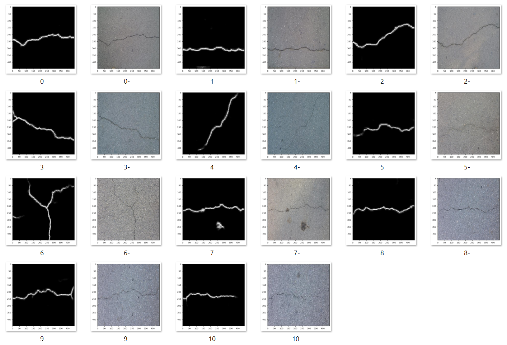
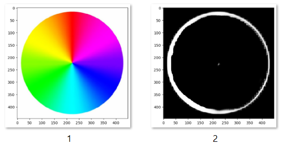

---
title: Concrete Crack Detection and Segmentation
lang: en-US
date-meta: '2022-11-27'
author-meta:
- Yu-Sian Lin, Chengyou Yue, Yueh-Ti Lee, Minjiang Zhu
header-includes: |-
  <!--
  Manubot generated metadata rendered from header-includes-template.html.
  Suggest improvements at https://github.com/manubot/manubot/blob/main/manubot/process/header-includes-template.html
  -->
  <meta name="dc.format" content="text/html" />
  <meta name="dc.title" content="Concrete Crack Detection and Segmentation" />
  <meta name="citation_title" content="Concrete Crack Detection and Segmentation" />
  <meta property="og:title" content="Concrete Crack Detection and Segmentation" />
  <meta property="twitter:title" content="Concrete Crack Detection and Segmentation" />
  <meta name="dc.date" content="2022-11-27" />
  <meta name="citation_publication_date" content="2022-11-27" />
  <meta name="dc.language" content="en-US" />
  <meta name="citation_language" content="en-US" />
  <meta name="dc.relation.ispartof" content="Manubot" />
  <meta name="dc.publisher" content="Manubot" />
  <meta name="citation_journal_title" content="Manubot" />
  <meta name="citation_technical_report_institution" content="Manubot" />
  <meta name="citation_author" content="Yu-Sian Lin, Chengyou Yue, Yueh-Ti Lee, Minjiang Zhu" />
  <meta name="citation_author_institution" content="Department of Civil and Environmental Engineering, University of Illinois" />
  <link rel="canonical" href="https://uiceds.github.io/cee-492-term-project-fall-2022-cmyy/" />
  <meta property="og:url" content="https://uiceds.github.io/cee-492-term-project-fall-2022-cmyy/" />
  <meta property="twitter:url" content="https://uiceds.github.io/cee-492-term-project-fall-2022-cmyy/" />
  <meta name="citation_fulltext_html_url" content="https://uiceds.github.io/cee-492-term-project-fall-2022-cmyy/" />
  <meta name="citation_pdf_url" content="https://uiceds.github.io/cee-492-term-project-fall-2022-cmyy/manuscript.pdf" />
  <link rel="alternate" type="application/pdf" href="https://uiceds.github.io/cee-492-term-project-fall-2022-cmyy/manuscript.pdf" />
  <link rel="alternate" type="text/html" href="https://uiceds.github.io/cee-492-term-project-fall-2022-cmyy/v/f30d5803aac82cb60ccf01ff8992a424ade3aea3/" />
  <meta name="manubot_html_url_versioned" content="https://uiceds.github.io/cee-492-term-project-fall-2022-cmyy/v/f30d5803aac82cb60ccf01ff8992a424ade3aea3/" />
  <meta name="manubot_pdf_url_versioned" content="https://uiceds.github.io/cee-492-term-project-fall-2022-cmyy/v/f30d5803aac82cb60ccf01ff8992a424ade3aea3/manuscript.pdf" />
  <meta property="og:type" content="article" />
  <meta property="twitter:card" content="summary_large_image" />
  <link rel="icon" type="image/png" sizes="192x192" href="https://manubot.org/favicon-192x192.png" />
  <link rel="mask-icon" href="https://manubot.org/safari-pinned-tab.svg" color="#ad1457" />
  <meta name="theme-color" content="#ad1457" />
  <!-- end Manubot generated metadata -->
bibliography:
- content/manual-references.json
manubot-output-bibliography: output/references.json
manubot-output-citekeys: output/citations.tsv
manubot-requests-cache-path: ci/cache/requests-cache
manubot-clear-requests-cache: false
...

## Authors

+ **Yu-Sian Lin, Chengyou Yue, Yueh-Ti Lee, Minjiang Zhu**  
  <small>
     Department of Civil and Environmental Engineering, University of Illinois
  </small>

## Introduction

The existence of cracks in concrete materials is of vital importance in Civil Engineering. An accurate and fast method to detect the existence of cracks in concrete images is always sought by engineers. Nowadays, even though a Convolutional neural network (CNN) based model can easily tell the existence of concrete cracks, the information of the exact locations of cracks is smeared in the network. We aim to firstly build a CNN-based model for crack detection, and then find and apply another model with the architecture called U-Net to locate the exact positions of cracks. 

We first train a CNN with the Surface Crack Detection dataset [@{https://www.kaggle.com/datasets/arunrk7/surface-crack-detection}] to judge if any concrete crack exists. The dataset contains images (each has $227 \times 227$ pixels and RGB channels) of concrete surfaces with or without crack. Each class contains $20000$ images. Examples are shown in Figure @fig:Negative_and_Positive:

{#fig:Negative_and_Positive height=2in}

The dataset is split into a training set with 4200 images and a testing set with 1800 images which are randomly selected from the dataset.

We then train a FCN-based network called U-Net [@doi:10.1007/978-3-319-24574-4_28] with the Concrete Crack Conglomerate Dataset [@doi:10.7294/16625056.v1] to segment the concrete from its cracks. 

The dataset contains over $20000$ crack images which include subsets named CFD, CRACK500, CRACKTREE etc. (each has $448 \times 448$ pixels and RGB channels). Each image data has an origin image and a mask image. Examples are shown in Figure @fig:Origin_and_Mask:

{#fig:Origin_and_Mask height=2in}

U-Net is an elegant architecture which can work with very few training images and yield precise segmentations. [@doi:10.1007/978-3-319-24574-4_28] Different from the large number of images used in classification, we only choose the CFD sets with 107 images for training and 11 for testing.

## Crack Detection

### A Brief Introduction to CNN 

{#fig:Basic_Convolutional_Neural_Network_for_Classification}

CNN network is briefly introduced in this section. As shown in Figure @fig:Basic_Convolutional_Neural_Network_for_Classification, a typical CNN network involves several convolutional and pooling layers, and then several fully connected layers. Convolution is an operation that uses filter to extract information that we want to detect. The filter size determines how many filters will be applied to the input data. The kernel size determines the size of the area that the filters would apply to. Activation function is added to import nonlinearity into the model, considering the operation of filter is linear. MaxPooling is a down-sampling operation that allows our network to capture deeper information from its original dimensions. The pool size and strides determine the dimensions of the down-sample procedure. Notice that the sigmoid function (rather than the softmax function shown in Figure @fig:Basic_Convolutional_Neural_Network_for_Classification) will be applied in our model, as as we only have two classes of results (True or False). 

### Network Design
In the first convolutional block, we would specify 16 filters (consider 8 straight lines and 8 curves) with 3 by 3 kernels (consider the size of crack is relatively small), assign ReLu as the activation function in the Conv2D layer, and go deeper with a pool size of 2 by 2 in the MaxPool2D layer. In the second convolutional block, we double the channels number to 32 with Conv2D and apply the same MaxPool2D. Finally, we apply an GlobalAveragePooling2D layer, as we are focusing on the whole image rather than a part of it in segmentation. The coding form of this model is shown in Figure @fig:Model_for_Concrete_Crack_Classification_using_Keras:

{#fig:Model_for_Concrete_Crack_Classification_using_Keras}

The result of our network would be a number in (0,1). We may treat it as the probability of the existence of crack in the image. Noticing that the original images have the size (227,227,3), we would resize it into (120,120,3) in the preprocessing procedure. The detailed properties of the network are listed in Figure @fig:Model_Summary_and_Hyperparameters and Table @tbl:CNNHyperparameters:

{#fig:Model_Summary_and_Hyperparameters height=4in}

| Training   | Validation | Testing    | Optimizer | Loss Function | Metrics | Max Epochs |
|:-----------|:------|:------|:------|:------|:------|:------|
| 4200 | 0.2 | 1800 | Adam | Binary Crossentropy | Accuracy | 100 | 

Table: **Hyperparameters**
{#tbl:CNNHyperparameters}

### Results and Analysis 

Below is the confusion matrix our model generated:

{#fig:Confusion_Matrix height=3in}

and the loss during the training process: 

{#fig:Loss_Evolution height=3in}

We can see that this trained model has good performance on the testing data. The training process only lasts for 25 epochs because of the early-stop procedure. We can further calculate the following parameters:

$$
\mathrm{Precision}=\frac{TP}{TP+FP}
\\
\mathrm{Recall}=\frac{TP}{TP+FN}
\\
\mathrm{Score}=2\times \frac{\mathrm{Precision}\times \mathrm{Recall}}{\mathrm{Precision}+\mathrm{Recall}}
\\
\mathrm{Macro} \mathrm{Avg}=\frac{1}{n}\sum_{i=1}^n{\mathrm{Score}_i}
\\
\mathrm{Weighted} \mathrm{Avg}=\frac{1}{n}\sum_{i=1}^n{\mathrm{Support}_i\times \mathrm{Score}_i}
$${#eq:regular-equation}

Their specific values are shown in Table @tbl:Result_Analysis:

| | Precision | Recall | Score | Support |
|:-----------|:------|:------|:------|:------|
| Negative	| 0.96|	0.99 | 0.98 | 917 | 
| Positive | 0.99 | 0.96 | 0.97 | 883 |	
| Macro Avg | 0.98 | 0.97 | 0.97 | 1800 |	
| Weighted Avg | 0.97 | 0.97 | 0.97 | 1000 |	

Table: **Result Analysis**
{#tbl:Result_Analysis}

In short, the network has overall good performance.

## Concrete Segmentation

### A Brief Introduction to CNN 

U-Net is built upon the so-called "Fully Convolutional Network", it was firstly introduced in 2015 and won the ISBI challenge for segmentation of neuronal structures in electron micropic stacks. The original U-Net architecture is shown below:

{#fig:U-net_Architecture}

Different from FCN, it supplement a usual contracting network by successive layers, where pooling operators are replaced by upsampling operators. It would keep the output from each convolutional layers and either concatenate it with upsampling result or simply add them together. This modification could take advantages from these precedures, to overcome the trade-off between localiztion accuracy and the use of context (FCN requires more max-pooling layers that reduce the localization accuracy, while small patches allow the network to see only little context).

### Modeling and Training 

To achieve segmentation, we have built and trained two models, one based on our own architecture, and the other based on the paper. 
We perform a normalization before plugging in the U-Net architecture based on the range of RGB numbers, as shown in @fig:Input_Normalization:

{#fig:Input_Normalization}

In the previous classification model, we have shown that the first convolutional block only needs 16 filters to perform well. We also add a random dropout in each convolution block to prevent the overfitting problem. Based on this experiment, we modified U-Net architecture as shown in Figure @fig:Modified_U-Net_Architecture: 

{#fig:Modified_U-Net_Architecture}

The original images have the size (448,448,3). We would keep this size for this network, but there is still a resizing procedure that allows this network to predict images with different sizes. The detailed architecture of this model is summarized in Figure @fig:Model_Summary:

{#fig:Model_Summary}

Other properties of this network is listed in Table @tbl:U-NetHyperparameters:

| Training   | Validation | Testing    | Optimizer | Loss Function | Metrics | Epochs |
|:-----------|:------|:------|:------|:------|:------|:------|
| 107 | 0.1 | 17 | Adam | Binary Crossentropy | Accuracy | 50 |

Table: **U-Net Hyperparameters**
{#tbl:U-NetHyperparameters}

The training and testing losses are plotted in Figure @fig:U-Net_Loss:

{#fig:U-Net_Loss height=3inch}

We can see that this trained model has good performance on the testing data. It only takes 30 epochs because of the early-stop procedure.

## Results and Analysis 

{#fig:Prediction_Result}

The prediction results of our testing images is shown in @fig:Prediction_Result. It performs well. However, we can also notice that in the testing image 7, the network recognizes the dark-colored zone as a crack. The reason is that the network is identify crack by detecting the edge of the color channels, we can illustrate this by predicting the crack from RGB color wheel.

{#fig:RGB_Result}

## Reproducible Work

We also provide the network codes, pre-trained models and datasets for reproducible work, they are under content.reproducible folder.

## Reference

U-Net: Convolutional Networks for Biomedical Image Segmentation
[@doi:10.1007/978-3-319-24574-4_28]

Computer vision-based concrete crack detection using U-net fully convolutional networks
[@doi:10.1016/j.autcon.2019.04.005]

Performance Evaluation of Deep CNN-Based Crack Detection and Localization Techniques for Concrete Structures
[@doi:10.3390/s21051688]

